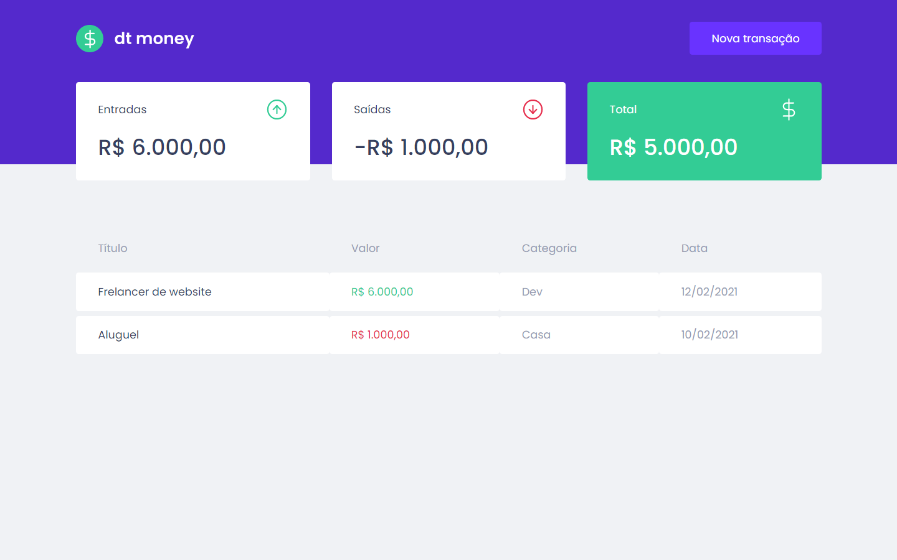
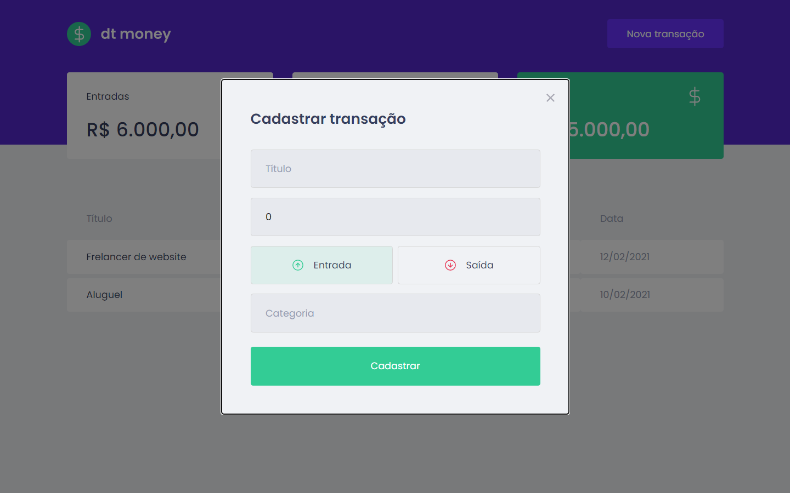

# DT Money
## First web application with React 
### Module 2 - RocketSeat - Ignite ReactJS 🔥

---
<p>
  
  
  <a href="https://opensource.org/licenses/MIT">
    
  </a>
</p>

## About The project

dt money is a simple and effective alternative to manage your finances, allowing you to register entries, exits and organize them into categories.

## Project Images





## Technologies

Technologies used in project development

- [React](https://reactjs.org/)
- [TypeScript](https://www.typescriptlang.org/)
- [Styled Components](https://styled-components.com/)
- [MirageJS](https://miragejs.com/)
- [Axios](https://github.com/axios/axios)
- [Polished](https://polished.js.org/)

## ⚙️ Running The Project

```
# Clone this repository
$ git clone https://github.com/jorgeeder/dt-money.git
# or use the download option.

# Access the dtmoney folder
$ cd dtmoney

# Install the dependencies
$ yarn install
or
$ npm install

# Running the Project
$ yarn start
or
$ npm start

# Access http://localhost:3000 in your browser

```

Made with 💜 by [Jorge Eder](https://github.com/jorgeeder)

<p>
  <a href="https://www.linkedin.com/in/jorgeeder/">
      
  </a>
  <a href = "mailto:jorgeeder.dev@gmail.com">
  
  </a>
</p>
